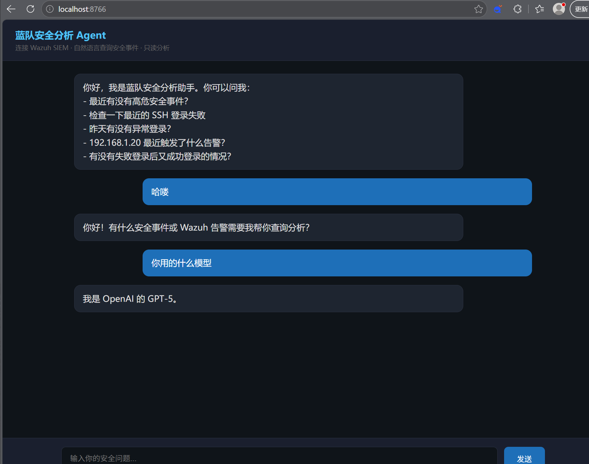

# 蓝队安全分析 Agent（Wazuh Security Agent）

基于 Wazuh SIEM 的**只读安全分析 Agent**：用自然语言对话查询安全事件，LLM 通过 function calling 自主调用工具获取真实数据，结合规则引擎做威胁研判，输出结构化中文报告。



## 核心能力

- **自然语言安全查询**：告警概览、SSH 暴力破解检测、来源 IP 溯源、失败后成功登录研判、监控主机状态
- **Function Calling Agent**：LLM 自主决策调用 5 个只读工具，多轮循环（上限 5 轮）直至拿到充分证据；**防幻觉设计**——每个结论必须基于工具返回的真实数据，无数据显示"未查询到相关事件"
- **规则研判引擎**：SSH 暴力破解检测（失败次数阈值 + 5 分钟时间窗 + 置信度打分 + 高权限账号尝试识别 + "失败后成功登录 = 疑似入侵"研判）
- **结构化报告**：结论 → 风险等级 → 关键证据 → 建议
- **只读安全边界**：只查询不处置（不封禁 IP、不改配置），查询限条数限时间，凭据环境变量化不硬编码

## 架构

```
用户自然语言
   │
   ▼
入口层  web_app.py（FastAPI 聊天界面） / main.py（CLI）
   │
   ▼
LLM 编排  function calling 自主决策，多轮循环（max 5 轮）
   │  ▲
   ▼  │ 工具结果回填
工具层  5 个只读工具（wazuh_tools.py）
   │
   ▼
数据层  Wazuh Indexer（OpenSearch）告警数据，只读查询
   │
   ▼
分析层  规则研判：SSH 暴力破解检测（ssh_detector）
   │
   ▼
报告层  中文报告：结论 → 风险 → 证据 → 建议
```

## 快速开始

```bash
# 1. 安装依赖
pip install -r requirements.txt

# 2. 配置环境变量（复制 .env.example 为 .env 并填写）
#    WAZUH_INDEXER_URL / WAZUH_USERNAME / WAZUH_PASSWORD / LLM_API_KEY / LLM_BASE_URL / LLM_MODEL

# 3. 启动 Web Agent（浏览器打开 http://localhost:8766）
python web_app.py

# 4. 或使用 CLI 单次提问
python main.py "检查最近的 SSH 登录失败"
```

## 工具列表

| 工具 | 说明 |
| --- | --- |
| `search_alerts` | 搜索告警，支持时间/IP/用户/主机/级别过滤 |
| `count_ssh_failures` | 按来源 IP 统计 SSH 登录失败，检测暴力破解 |
| `check_ssh_success_after_failure` | 研判"失败后成功登录"（被入侵关键指标） |
| `alert_summary` | 告警概览：按主机/规则聚合统计 |
| `list_agents` | 查询监控主机（agent）列表与状态 |

## 支持的问题示例

- 最近有没有高危安全事件？
- 检查一下最近的 SSH 登录失败
- 昨天有没有异常登录？
- 192.168.1.20 最近触发了什么告警？
- 有没有失败登录后又成功登录的情况？

## 项目结构

```
├── web_app.py              # Web Agent 入口（FastAPI + function calling 循环）
├── main.py                 # CLI 入口（轻量查询）
├── wazuh_tools.py          # 工具定义（OpenAI function calling schema）+ 执行器
├── llm_client.py           # LLM 客户端（OpenAI 兼容）
├── indexer_client.py       # Wazuh Indexer（OpenSearch）只读客户端
├── config.py               # 环境变量配置
├── analysis/
│   ├── event_parser.py     # 告警事件字段解析
│   └── ssh_detector.py     # SSH 暴力破解检测引擎
├── report/
│   └── formatter.py        # 中文报告格式化
├── tools/
│   ├── alerts.py           # 告警查询
│   └── login_events.py     # 登录事件查询
└── docs/agent-ui.png       # 界面截图
```

## 安全边界

- ✅ 只读：查询告警、统计事件、分析风险
- ❌ 不自动处置：不封禁 IP、不禁用用户、不改配置
- ✅ 凭据从环境变量读取（.env），不硬编码
- ✅ 查询有数量（500 条）和时间范围（默认 24h，上限 7 天）限制
- ✅ 结论强制基于工具返回的真实数据，防 LLM 幻觉

## 技术栈

Python · Wazuh SIEM · OpenSearch · OpenAI-compatible LLM API · FastAPI · function calling

## License

[Unlicense](LICENSE)
